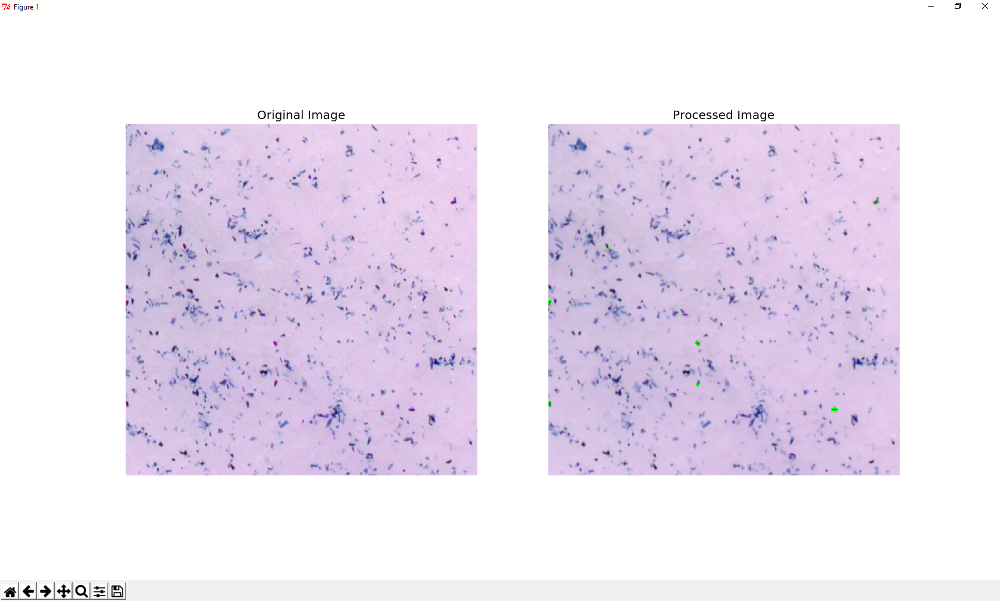

**Nematode Egg Counting**

This application reads high resolution scanner images and tracks and counts stained nematode eggs using OpenCV 3.1 and Python

Requirments
-----------
*Environment Setup*

* Download & Install <a href="http://opencv.org/downloads.html" target="_blank"> OpenCV 3.1.0</a> 

This requires Python2.7 and the Python wrapper for OpenCV.
It was tested on Windows and Mac OS X.

Usage
-----
Run ``python src/scanner_img_processing.py``

Steps involved
--------------
The code performs these following steps:

1. Read high resolution scanner image and split into 1024*1024*3 block and store them as a list of numpy arrays
2. It loops though each block and detects any eggs in that block and prints the count
3. Total egg count is printed along with the time taken for the script at the end 

Here are some of the snapshots
-------------------------------

License
-------

This code is GNU GENERAL PUBLIC LICENSED.

Contributing
------------

If you have any suggestions or identified bugs please feel free to post them! 

