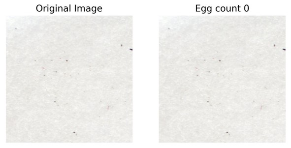
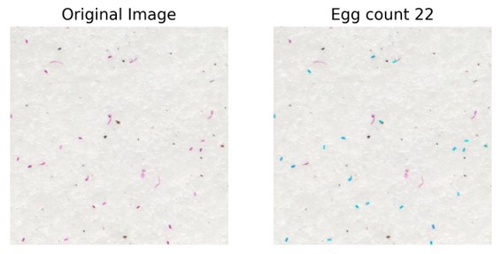
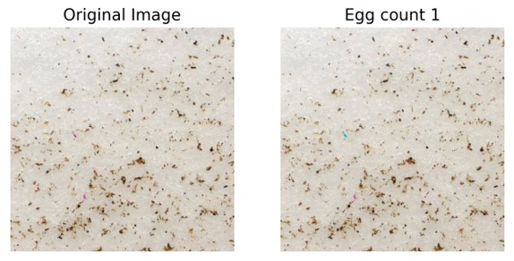

**Nematode Egg Counting**

This application reads an high resolution image file, extracts objects and \
gets the total count of them.

Requirments
===========

*Environment Setup*

Download & Install Python_ using Anaconda_ or Miniconda_ \
(**Recommended**)

Then you can run the following commands install required packages

.. code-block:: bash

   conda install -y opencv3 matplotlib numpy tqdm

*It is compatible with Python 2 and Python 3*
*It was tested on Windows and Mac OS X.*

Usage
=====
Clone this repository and change directory

.. code-block:: bash

   git clone https://github.com/ukalwa/nematode_egg_counting
   cd nematode_egg_counting

Configuration file `analysis/config.ini` contains all the settings for blob
identification, fig sizes and so on. Before running the script, update
accordingly.

To process a single file using file dialog GUI

.. code-block:: bash

   python run_script.py -uf

To process a directory full of image using file dialog GUI

.. code-block:: bash

   python run_script.py -ud

To process a single file with its known absolute file path

.. code-block:: bash

   python run_script.py -f <file_path>

To process a directory full of images with known path

.. code-block:: bash

   python run_script.py -d <dir_path>

To process only some files in a directory with known path

.. code-block:: bash

   python run_script.py -d <dir_path> -p <pattern string>

Steps involved
==============

The code takes the reconstructed videos to count the number of eggs.

    1. It extracts the configuration parameters related to blob \
    identification, figure sizes, bounding box parameters and so on
    2. Read the image file as a 3-d numpy array and splits it into \
    various blocks and stores them as a list of numpy arrays.
    3. It then loops though each block and detects any eggs based on \
    parameters set in the config file and records the count and adds it to\
    the total count
    4. After all the blocks are completed, total egg counts, blocks with \
    bounding boxes around eggs, egg params are all saved in text files \
    for reference and debugging purposes

Here are some snapshots
==============================
The one on the left is a block of the original image and the one on the right
is the processed image with eggs identified and labelled with bounding boxes

**Top layer**

**Interface layer**

**Bottom layer**

Documentation
==============================

For generating documentation, please follow these steps:
Make sure you have sphinx installed, you can install it like this

.. code-block:: bash

   pip install sphinx

Move to the docs directory and run make. It takes couple of minutes to \
generate the build files.

.. code-block:: bash

   cd docs
   make html
   explorer build\html\index.html

License
=======

This code is GNU GENERAL PUBLIC LICENSED.

Contributing
============

If you have any suggestions or identified bugs please feel free to post
them!

.. _OpenCV 3.4.0: http://opencv.org/downloads.html
.. _Python: https://www.python.org/downloads/
.. _numpy: https://www.scipy.org/scipylib/download.html
.. _matplotlib: https://matplotlib.org/
.. _Anaconda: https://www.anaconda.com/download/
.. _Miniconda: https://conda.io/miniconda.html
